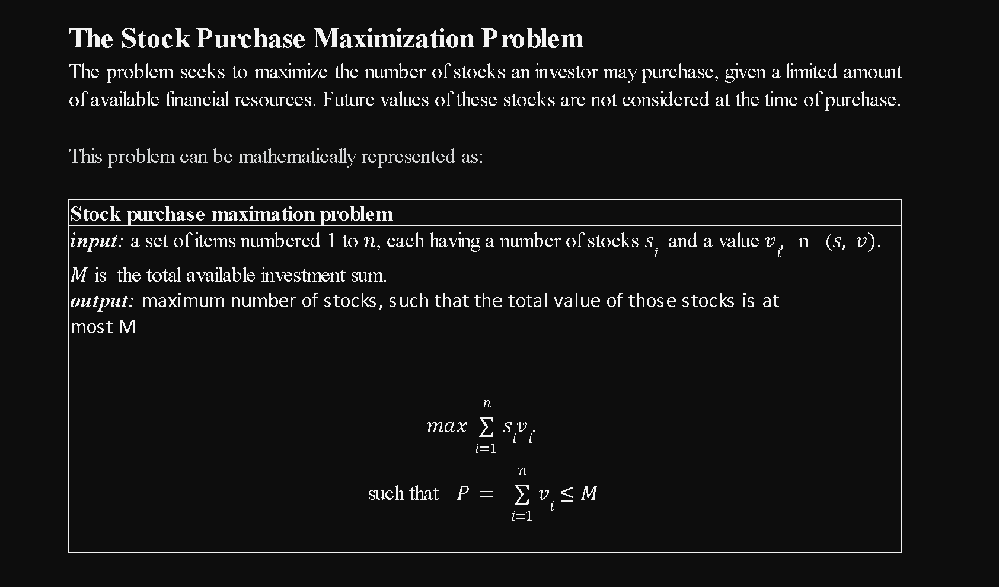

# Project 2: Exhaustive vs. Dynamic Programing

## Author & Email
- Author: Sokheng Teang, Chance Noonan, Cesar Rojas Rojas
- Email: [sokhengteang@csu.fullerton.edu]

## Abstract
In this project, we will design, implement and analyze an exhaustive search algorithm dynamic programming algorithm for solving the same problem.  


## Problem Statement



## Setup and Running

### Prerequisites

- Python 3.x

### Instructions

1. Ensure you have Python installed on your machine.
2. Clone or download this repository.
3. Navigate to the directory containing `Project1_starter.py`.
4. Run the Python script using the command:
```bash
python3 max_stock.py